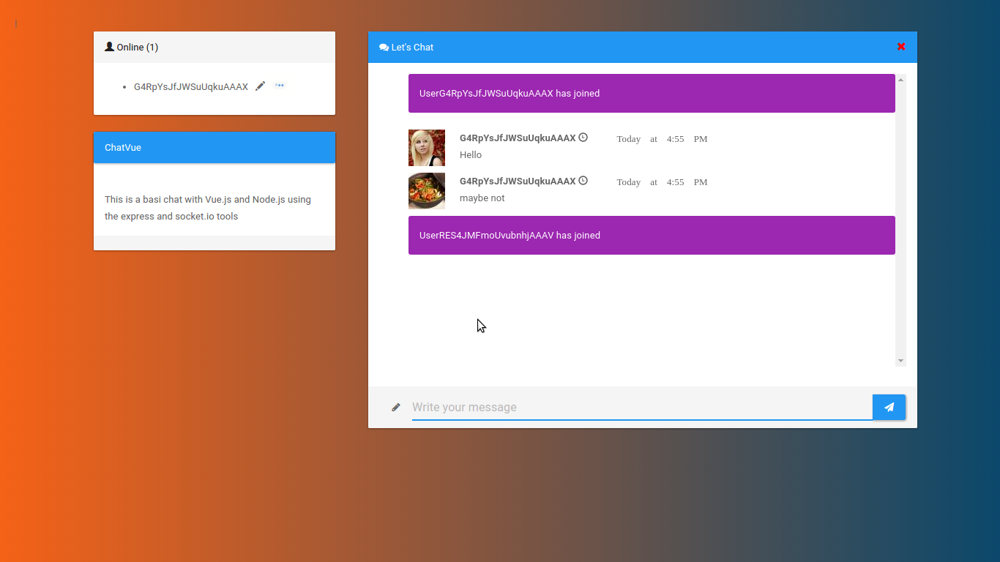

## ChatVue

## Backend Tools
  - Node.js
    - Express
    - Socket.io
    - npm
    - Babel

## FrontEnd Tools
  - Vue.js
  - Font Awesome
  - Bootstrap3
    - [Bootswatch - Paper Theme](https://bootswatch.com/paper/bootstrap.min.css)
  - [uiGradients](https://uigradients.com)
  - Placeholder Images
    - [LoremPixel](http://lorempixel.com/)
    - [Placeholder](https://placeholder.com/)
  - [Moment.js](https://momentjs.com/)

## What is Next?
- move all dependencies to npm with webpack
- use a real avatar image
- save messages on a databse
- multiple chat room
- private messages
- emojis
